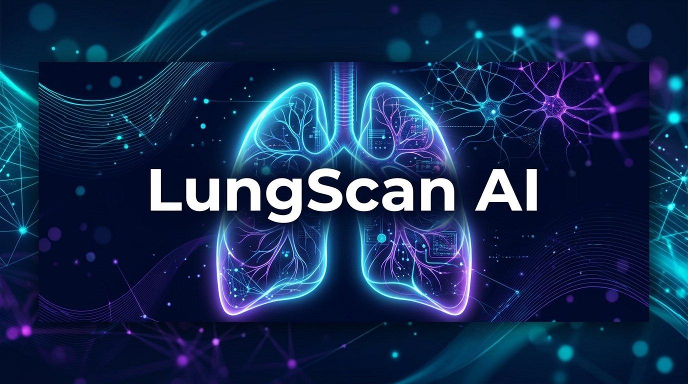
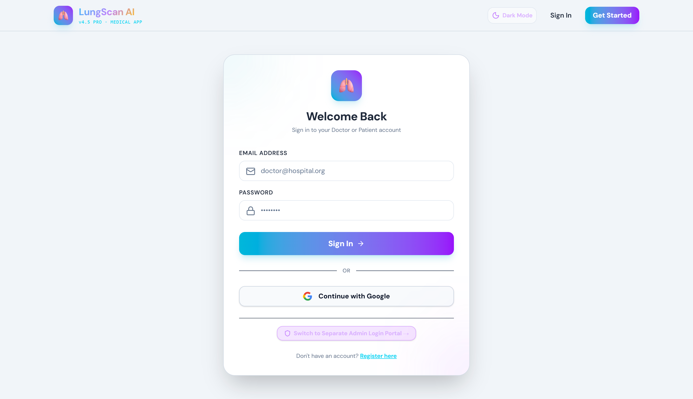
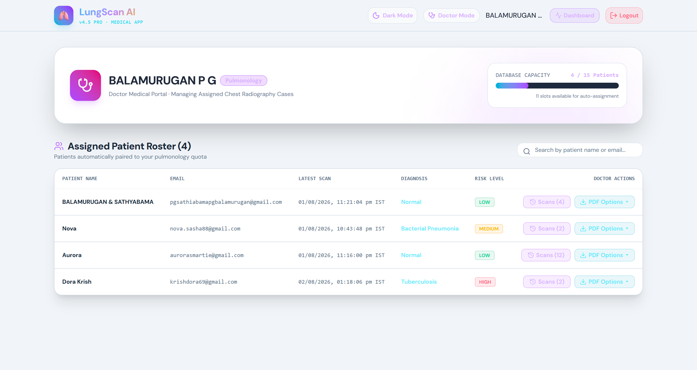
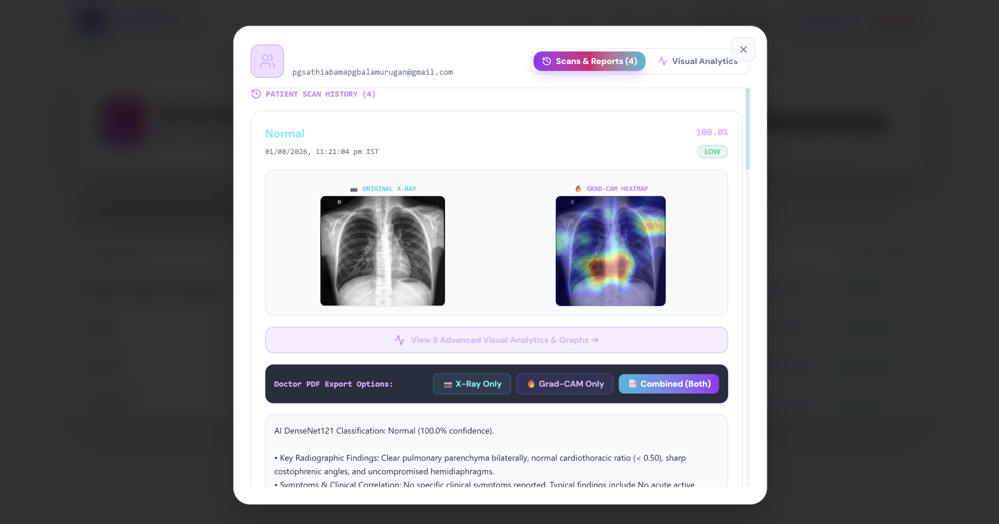
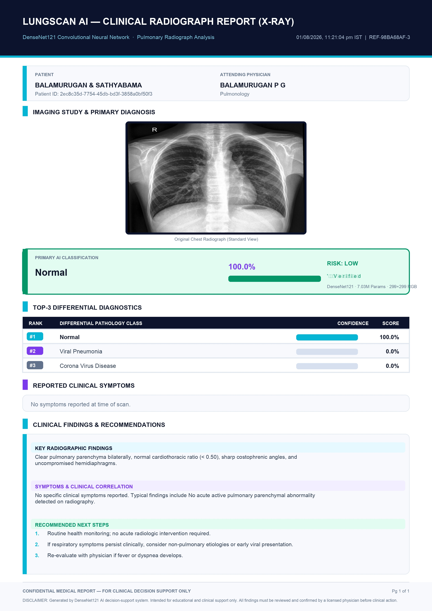
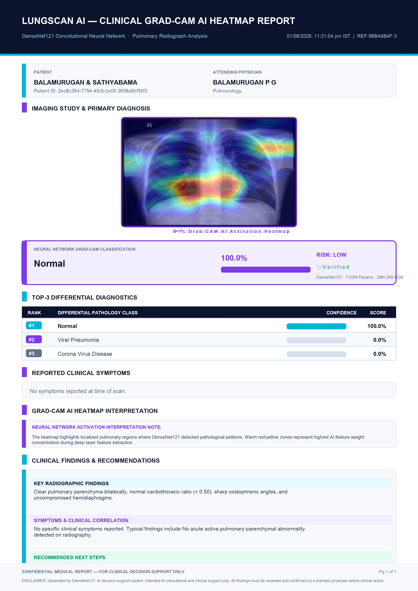
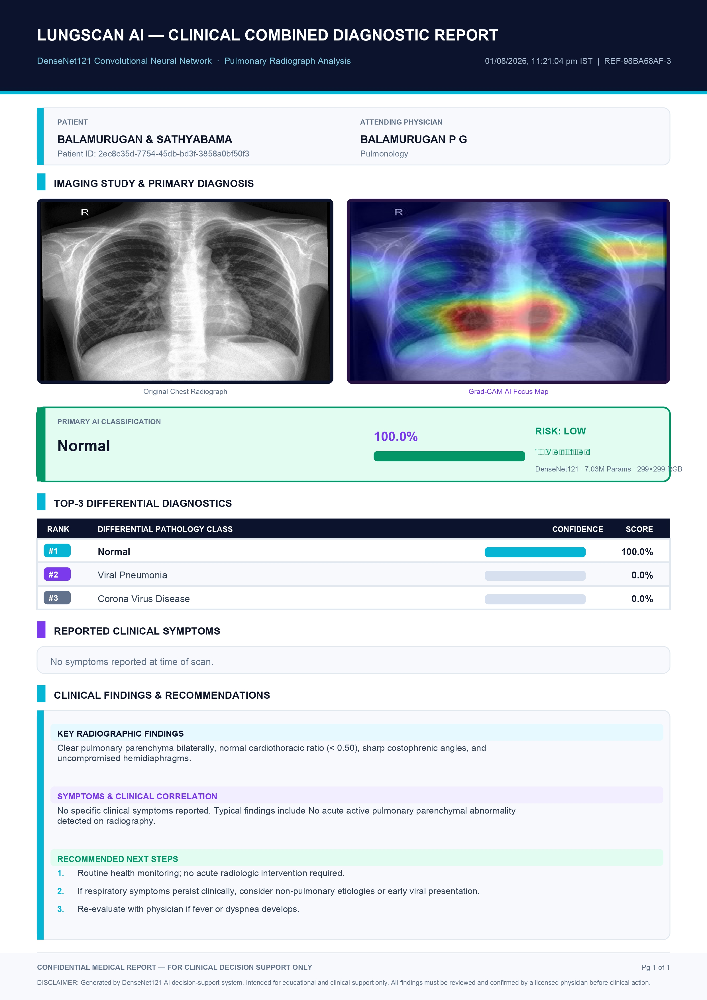

<div align="center">
  
  
  <h1>🫁 LungScan AI – Multi-Class Chest X-ray Disease Detection</h1>
  
  <p><strong>A comprehensive, full-stack AI/ML healthcare application designed to detect multiple lung diseases from Chest X-ray images.</strong></p>

  <p>
    
    
    
    
    
    
  </p>
  
  <p>
    
    
    
    
    
    
  </p>
</div>

---

Welcome to **LungScan AI**. This project was built as part of my **AI/ML Technical Training** to demonstrate end-to-end machine learning deployment—from deep learning model creation to building a highly responsive, animated frontend and a robust backend API.

## 🚀 Project Overview

**LungScan AI** leverages a state-of-the-art Convolutional Neural Network (`DenseNet121`) to analyze chest X-rays and classify them into 5 distinct classes. It incorporates **Grad-CAM (Gradient-weighted Class Activation Mapping)** to provide visual explanations of the model's predictions, highlighting the specific regions of the X-ray that influenced the AI's decision. 

The system features a multi-role architecture, separating patient and doctor dashboards with comprehensive visual analytics, secure authentication, fluid GSAP animations, and automated PDF report generation.

### ⚠️ Disclaimer
> **This is a technical training/learning project.** The AI models and predictions provided by this software are for educational and demonstration purposes only. They are **not** a replacement for professional medical advice, diagnosis, or treatment by qualified healthcare professionals.

---

## ✨ Features

- **Multi-Class Disease Detection:** Classifies Chest X-rays into 5 distinct disease classes.
- **Grad-CAM Explainable AI (XAI):** Generates heatmaps providing visual transparency for the AI's predictions.
- **Single & Batch Scan Upload:** Flexible image upload capabilities for rapid or bulk screening.
- **Side-by-Side Comparison:** Visually compare the original X-ray with the Grad-CAM heatmap.
- **Top-3 Predictions:** Displays the top 3 probable classes along with their confidence scores.
- **Low Confidence & Human Review Flags:** Automatically flags predictions with low confidence for human/doctor review.
- **Patient Symptoms Input:** Contextualize AI predictions with patient-reported symptoms.
- **Visual Analytics & Graphs Tab:** Interactive dashboards displaying scan history, confidence trends, and disease distributions.
- **Automated PDF Reports:** Generate downloadable, professional PDF reports directly from the interface.
- **Role-Based Dashboards:** Distinct user experiences for **Patients** (viewing their own scans/reports), **Doctors** (managing multiple patients, analyzing visual analytics), and **Admins**.
- **Secure Authentication:** Powered by Supabase for secure user login, registration, and structured data storage.
- **Buttery Smooth UI/UX:** Ultra-smooth micro-interactions, page transitions, and visual feedback powered by **GSAP (GreenSock)**. Fully responsive across mobile, tablet, and desktop.

---

## 🧠 Model Performance & Architecture

- **Model Architecture:** `DenseNet121` (Transfer Learning)
- **Input Size:** `299 × 299` pixels
- **Classes (5):**
  - Normal
  - Bacterial Pneumonia
  - Viral Pneumonia
  - Corona Virus Disease
  - Tuberculosis
- **Performance:** Achieved high test accuracy during evaluation, demonstrating robust feature extraction capabilities on medical imaging datasets.
- **Explainability:** Integrated **Grad-CAM** layer interpretation to visualize localized features driving the classification.

> **💡 Upload Your Notebook:** Have a Jupyter Notebook for model training or data exploration? You can upload it to the `notebooks/` directory in this repository to share your research process!

---

## 🛠️ Tech Stack

### Deep Learning & AI
- **TensorFlow / Keras:** Model building, fine-tuning, and Grad-CAM implementation.
- **NumPy & Pillow (PIL):** Image processing and tensor manipulation.

### Backend
- **FastAPI:** High-performance RESTful API for handling inference requests, file uploads, and data fetching.
- **Uvicorn:** ASGI web server.
- **Pydantic:** Data validation and serialization.

### Frontend & Database
- **React.js (Vite):** Dynamic, component-based user interface.
- **Tailwind CSS & GSAP:** Modern styling and high-performance 120fps GPU animations.
- **jsPDF & html2canvas:** Client-side dynamic automated PDF report generation.
- **Supabase:** PostgreSQL database, secure authentication, and user management.

---

## 📸 Screenshots & Walkthrough

Here is a look at the various interfaces and features of LungScan AI.

### 1. Login & Registration
Secure authentication portal powered by Supabase.


### 2. Patient Dashboard
A comprehensive view for patients to upload new X-rays, view their scan history, and access reports.


### 3. Patient Visual Analytics
Interactive charts displaying prediction confidence and historical trends for the patient.


### 4. Doctor Dashboard
A unified interface for healthcare professionals to monitor all patient scans and manage records.


### 5. Prediction Results & Scans (Side-by-Side)
Detailed breakdown of a scan, showing top predictions, confidence scores, and the side-by-side original vs Grad-CAM heatmap.


### 6. Doctor Visual Analytics
Aggregate analytics for doctors to understand disease distribution across all their patients.


### 7. Automated PDF Reports
The platform supports generating various styles of PDF reports.

| Original X-Ray Report | Grad-CAM Report | Combined Report |
| :---: | :---: | :---: |
|  |  |  |

---

## ⚙️ Installation & Setup

Follow these steps to run the project locally.

### Prerequisites
- Python 3.10+
- Node.js & npm
- A Supabase account (for database and auth)

### 1. Clone the repository
```bash
git clone https://github.com/balamuruganpg/LungScan-AI-Chest-Xray-Detection.git
cd LungScan-AI-Chest-Xray-Detection
```

### 2. Environment Variables
You will need to set up `.env` files for both the backend and frontend with your respective Supabase API URLs and anon keys.
- **Frontend:** Create a `.env` in the `/frontend` directory.
- **Backend:** Create a `.env` in the `/app` (or root) directory.
> ⚠️ **IMPORTANT:** Never commit your `.env` files or secret keys to version control! The provided `.gitignore` already ensures these are excluded.

### 3. Backend Setup (FastAPI)
```bash
# Navigate to the project root
# Create a virtual environment
python -m venv venv

# Activate the virtual environment
# Windows:
venv\Scripts\activate
# Mac/Linux:
source venv/bin/activate

# Install requirements
pip install -r requirements.txt
```

> **Note:** The pre-trained `densenet121_best.keras` model (~72MB) is **included** directly in the `Models/` directory of this repository! You do not need to download or train the model separately to get started.

```bash
# Start the FastAPI server
cd app
uvicorn main:app --reload --host 0.0.0.0 --port 8000
```

### 4. Frontend Setup (React)
Open a new terminal window.
```bash
# Navigate to the frontend directory
cd frontend

# Install dependencies
npm install

# Start the development server
npm run dev
```

---

## 📂 Project Structure

```text
LungScan-AI-Chest-Xray-Detection/
│
├── app/                        # 🚀 FastAPI Backend source code
│   ├── main.py                 # Core API endpoints & server setup
│   └── model_loader.py         # AI Model loading & Grad-CAM inference logic
│
├── frontend/                   # 💻 React (Vite) Frontend source code
│   ├── src/                    # Components, Pages, context, GSAP animations
│   ├── public/                 # Static assets
│   └── package.json            # Node.js dependencies
│
├── NoteBooks/                  # 📓 Jupyter Notebooks for AI Model Training & EDA
│   ├── lungs-xray-densenet121.ipynb
│   ├── lungs-ray-efficientnetb3.ipynb
│   └── lungs-xray-efficientnetv2l.ipynb
│
├── Models/                     # 🧠 Trained AI Model Weights (e.g., densenet121_best.keras)
├── Lung Disease Dataset/       # 📊 Dataset directory (X-ray images)
├── UI_and_Feautures_ScreenShot/# 📸 Screenshots used in this README
├── requirements.txt            # 🐍 Python backend dependencies
└── README.md                   # 📖 Project documentation
```

---

## 🎓 Learning Outcomes

Through building LungScan AI, I gained practical experience in:
- Training and fine-tuning Deep Learning architectures (**DenseNet121**) for medical image analysis.
- Implementing **Explainable AI (XAI)** techniques like Grad-CAM to demystify neural network predictions.
- Developing high-performance REST APIs with **FastAPI**.
- Building responsive, multi-role user interfaces using **React**, Vite, and Tailwind CSS.
- Implementing high-performance UI animations using **GSAP**.
- Integrating robust authentication and relational database modeling using **Supabase (PostgreSQL)**.

## 🔮 Future Improvements

- **Expand Disease Classes:** Train the model on larger, more diverse datasets to detect a wider variety of lung conditions.
- **Model Optimization:** Convert the model to TFLite or ONNX for faster inference and edge-device compatibility.
- **Enhanced Doctor Tooling:** Implement features for doctors to annotate X-rays and provide feedback to actively improve model training (Active Learning).

---

### 👨‍💻 Author
**BALAMURUGAN P G**  
📧 balamuruganpg@outlook.com  

*If you found this project interesting, feel free to reach out or explore my other repositories!*
